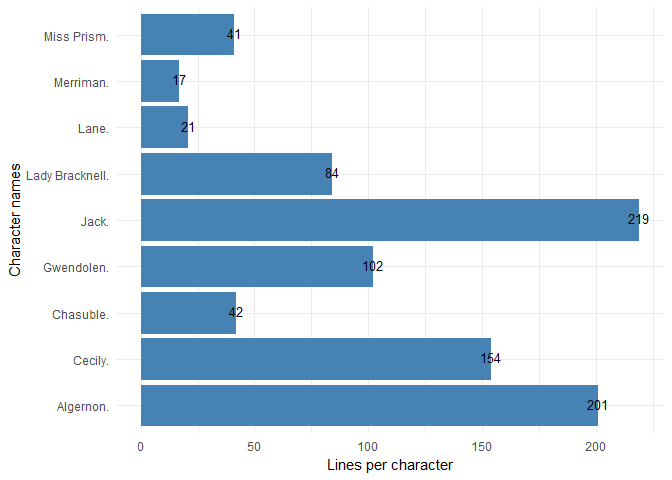

String\_Manipulation::Project-Gutenberg
================
Ali Gharaee
January 19, 2018

Introduction
============

Project Gutenberg offers over 56,000 free eBooks. You will find the world's great literature there, especially older works for which copyright has expired. They digitized and diligently proofread them with the help of thousands of volunteers.

For this mini-project, I have downloaded the **Importance of Being Earnest book** by **Oscar Wilde** for string manipulation and text mining.

Who would you like to play, if you can pick your role? If you are like me you will probably like the character with the fewest lines or perhaps you will go with the character with the most lines. My goal is to read the book in R and using my string processing skills in order to count the number of lines each character gets.

Original book comes from the **Project Gutenberg** see [Project Gutenberg](http://www.gutenberg.org/ebooks/search/?query=importance+of+being+earnest) for more detail.

Packages instalation
--------------------

``` r
library(tidyverse)
library(rebus)
library(stringr)
library(stringi)
```

Data Import
-----------

I've already downloaded the book as a plain text file. I read it into R using `stringi::stri_read_lines`.

``` r
earnest <- stri_read_lines("importance_of_being_earnest.txt")
head(earnest , n = 10)
```

             
    ## [1] "The Project Gutenberg eBook, The Importance of Being Earnest, by Oscar"
    ## [2] "Wilde"                                                                 
    ## [3] ""                                                                      
    ## [4] ""                                                                      
    ## [5] "This eBook is for the use of anyone anywhere at no cost and with"      
    ## [6] "almost no restrictions whatsoever.  You may copy it, give it away or"  
    ## [7] "re-use it under the terms of the Project Gutenberg License included"   
    ## [8] "with this eBook or online at www.gutenberg.org"                        
    ## [9] ""                                                                      
    ## [10] "" 

There are some for-word and after-word text that Project Gutenberg has added to the book. I want to remove them and then split the book into the introduction (the list of characters, scenes, etc.) and the main body.

Use the `stringr::str_detect` to find the lines:

``` r
# Find the lines that end the foreword and start of afterword 
# by detecting the patterns "START OF THE PROJECT" and "END OF THE PROJECT"
start <- which(str_detect(earnest, fixed("START OF THE PROJECT")))
end <- which(str_detect(earnest, fixed("END OF THE PROJECT")))

# Get rid of gutenberg intro text
earnest_sub  <- earnest[(start + 1) :(end - 1)]

# Detect the line that starts the first act by looking for the pattern "FIRST ACT".
lines_start <- which(str_detect(earnest_sub, fixed("FIRST ACT")))

# Set up index
intro_line_index <- 1:(lines_start - 1)

# Split play into intro and play
intro_text <- earnest_sub[intro_line_index]
book_text <-  earnest_sub[-intro_line_index]

# Take a look at the first 20 lines 
writeLines(book_text[1:20])
```

    ## FIRST ACT
    ## 
    ## 
    ## SCENE
    ## 
    ## 
    ## Morning-room in Algernon's flat in Half-Moon Street.  The room is
    ## luxuriously and artistically furnished.  The sound of a piano is heard in
    ## the adjoining room.
    ## 
    ## [Lane is arranging afternoon tea on the table, and after the music has
    ## ceased, Algernon enters.]
    ## 
    ## Algernon.  Did you hear what I was playing, Lane?
    ## 
    ## Lane.  I didn't think it polite to listen, sir.
    ## 
    ## Algernon.  I'm sorry for that, for your sake.  I don't play
    ## accurately--any one can play accurately--but I play with wonderful
    ## expression.  As far as the piano is concerned, sentiment is my forte.  I

It is clear that there are lots of empty lines. They don't really affect the process so I used `stringi::stri_isempty` to find empty strings and remove them. `stri_isempty()`returns a logical that I am going to use to subset the not-empty strings later:

``` r
# Get rid of empty strings
empty <- stri_isempty(book_text)
book_lines <- book_text[!empty]
book_lines[10:15]
```

    ## [1] "Algernon.  I'm sorry for that, for your sake.  I don't play"             
    ## [2] "accurately--any one can play accurately--but I play with wonderful"      
    ## [3] "expression.  As far as the piano is concerned, sentiment is my forte.  I"
    ## [4] "keep science for Life."                                                  
    ## [5] "Lane.  Yes, sir."                                                        
    ## [6] "Algernon.  And, speaking of the science of Life, have you got the"

Considering the lines, the first line is for *Algernon*, the next three strings are continuations of that line, then line 5 is for *Lane* and line 6 for *Algernon*. Lines that start with a word followed by a `.` .

I know the characters names from the book introduction. So, I specifically looking for lines that start with their names. I have created the *characters* vector with all the characters names.

I created a pattern that matches the start of the string, followed by one of the characters names using `rebus::or1()` followed by a `.`.

Then pull out the *lines* that match with `stringr::str_subset`,followed by `stringr::str_extract` to pull out only the parts that matched:

``` r
# Create vector of characters
characters <- c("Algernon", "Jack", "Lane", "Cecily", "Gwendolen", "Chasuble", 
  "Merriman", "Lady Bracknell", "Miss Prism")

# Match start, then character name, then .
pattern_chr <- START %R% or1(characters) %R% DOT

# Pull out the lines that match with
lines <- str_subset(book_lines, pattern_chr)

# Extract match from lines
players <- str_extract(lines, pattern_chr)
```

Finally, take a look at the unique characters and tally up how many lines each character had, using table() function.

``` r
# See unique characters
unique(players)
```

    ## [1] "Algernon."       "Lane."           "Jack."           "Cecily."        
    ## [5] "Gwendolen."      "Lady Bracknell." "Miss Prism."     "Chasuble."      
    ## [9] "Merriman."

``` r
# Count lines per character
table(players)
```

    ## players
    ##       Algernon.         Cecily.       Chasuble.      Gwendolen. 
    ##             201             154              42             102 
    ##           Jack. Lady Bracknell.           Lane.       Merriman. 
    ##             219              84              21              17 
    ##     Miss Prism. 
    ##              41

The output contingency table are of class table. The behavior of these objects is not quite like a data frame. So convert it to a data frame for simple visualization with `ggplot2`.

``` r
#
cast <- as.data.frame(table(players))

ggplot(cast, aes(x=players, y=Freq)) +
  geom_bar(stat="identity", fill="steelblue")+
  labs(y  = "Lines per character", x ="Character names")+
  coord_flip()+
  geom_text(aes(label=Freq), vjust=0.3, size=3.5)+
  theme_minimal()
```


